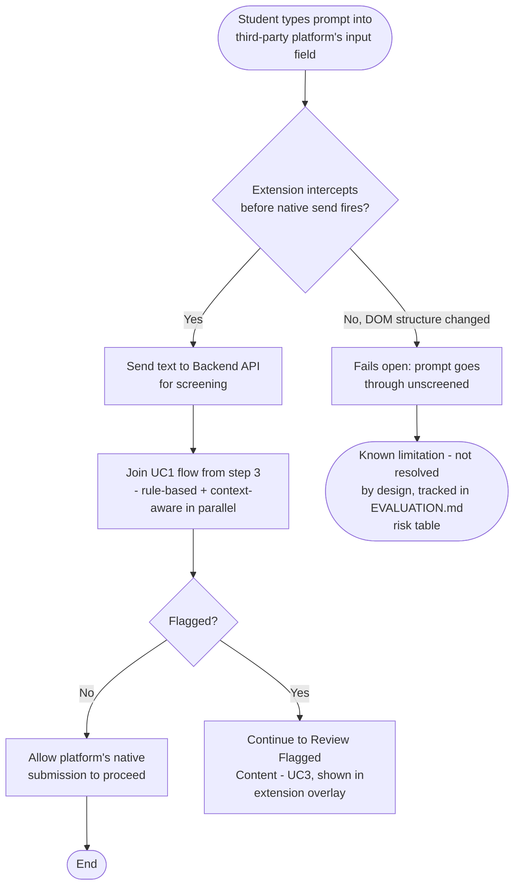
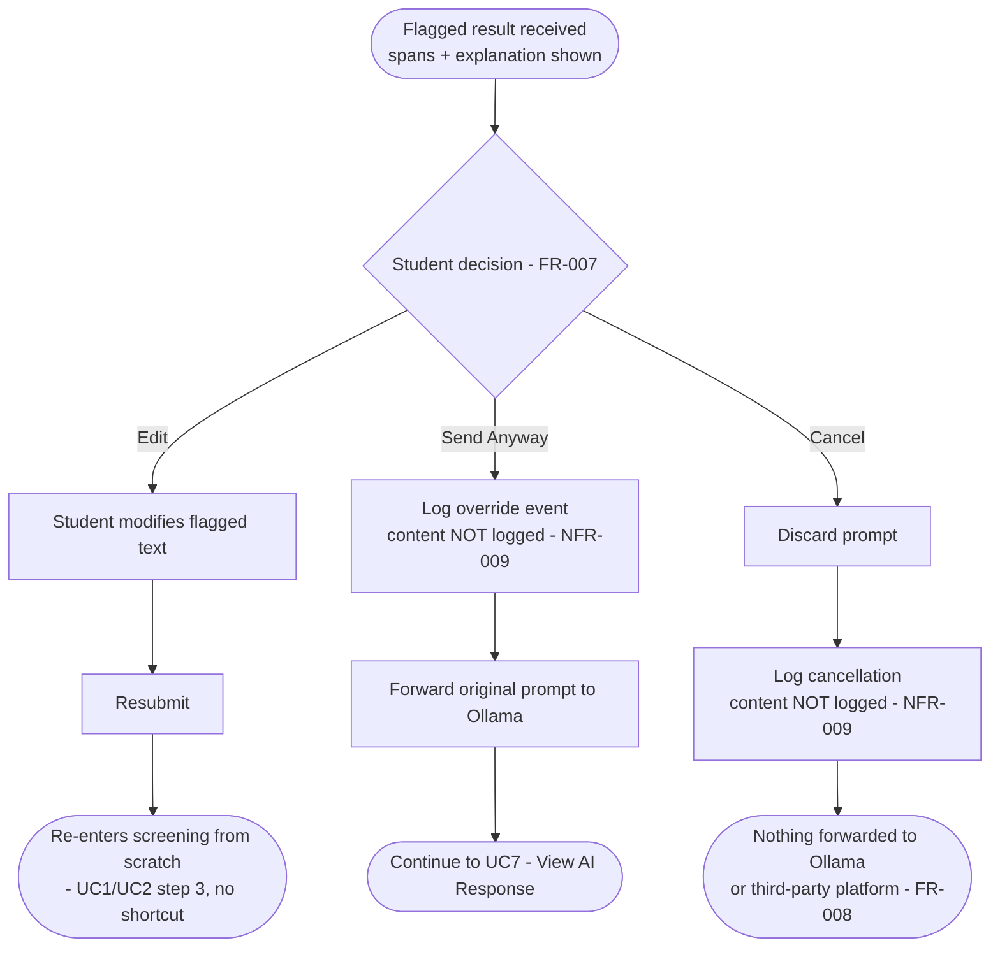
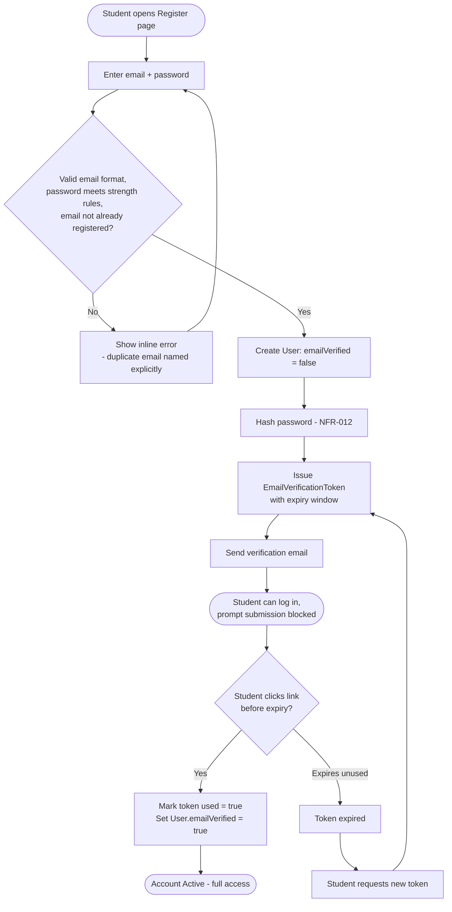
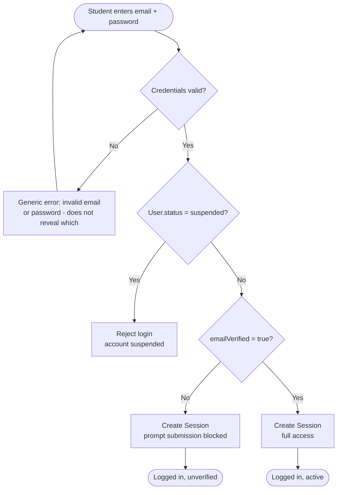
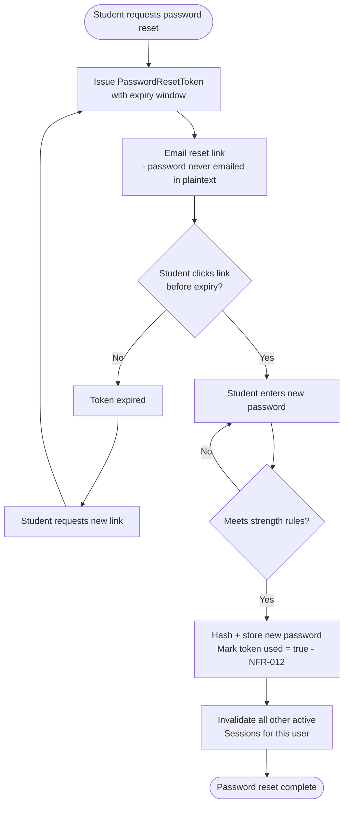
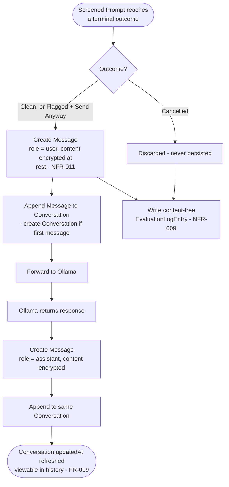
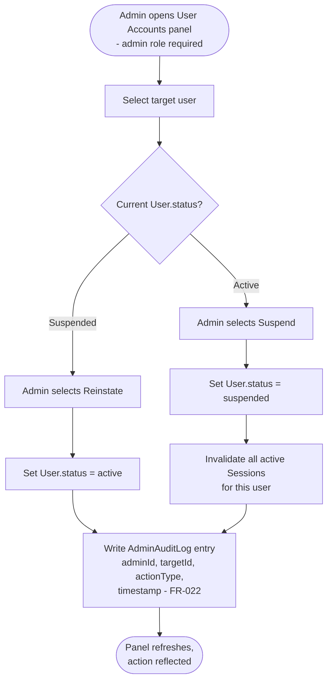

# ACTIVITY_DIAGRAMS.md — SentryPrompt4

**Project:** SentryPrompt4
**Traceability:** Each activity diagram operationalizes one or more use cases from USE_CASES.md and functional requirements from REQUIREMENTS.md. Diagrams are grouped into the original screening-flow core (1–3) and the platform-layer scope expansion (4–7), matching the split already established in DOMAIN_MODEL.md and PROJECT_BACKLOG.md Increment 4's brief: *"now including account lifecycle ... and message-persistence workflow."*

**Notation note:** rendered as Mermaid `flowchart` diagrams rather than classic UML swimlane/activity notation, for the same documented reason given in USE_CASES.md — Mermaid has no native UML activity-diagram type, and the assignment brief explicitly permits Mermaid as a workaround. Fork/join points (parallel detection) are called out explicitly in node labels since Mermaid flowcharts have no native fork/join bar.

---

## 1. Prompt Submission & Screening — Web App (UC1)

**Traces to:** FR-001–FR-008

```mermaid
flowchart TD
    A([Student types prompt]) --> B[Submit]
    B --> C{Non-empty input?}
    C -- No --> D[Show validation error - FR-001]
    D --> A
    C -- Yes --> E[/Fork: dispatch to both detectors\nin parallel - FR-004/]
    E --> F[Rule-based detector - FR-002]
    E --> G[Context-aware detector - FR-003]
    F --> H[/Join: wait for both/]
    G --> H
    H --> I[Aggregate verdicts]
    I --> J{Flagged?}
    J -- No --> K[Forward prompt to Ollama - FR-008]
    J -- Yes --> L[Highlight flagged span(s) - FR-005]
    L --> M[Show plain-language explanation - FR-006]
    M --> N[Continue to Review Flagged Content - UC3]
    K --> O[Ollama generates response - FR-009]
    O --> P[Return response via web app - FR-009]
    P --> Q([End])
```

**Notes:** the fork/join around the two detectors is the diagram-level enforcement of FR-004 — both branches must complete before `Aggregate verdicts` runs; there is no path that skips one detector.

---

## 2. Prompt Submission — Browser Extension (UC2)

**Traces to:** FR-010



**Notes:** the "fails open" branch is documented here rather than omitted, matching USE_CASES.md's own honesty about this as a named, unresolved risk — not hidden behind a clean happy-path diagram.

---

## 3. Review Flagged Content & Decide (UC3–UC6)

**Traces to:** FR-005–FR-008



---

## 4. Registration & Email Verification

**Traces to:** FR-013, FR-014



---

## 5. Login

**Traces to:** FR-015



**Notes:** the account-enumeration protection from FR-015's acceptance criterion (invalid email vs. invalid password must look identical to the student) is shown as a single merged error branch, not two separate ones — the diagram itself enforces the non-disclosure the requirement demands.

---

## 6. Password Reset

**Traces to:** FR-017



---

## 7. Message Persistence Workflow

**Traces to:** FR-019, FR-020, NFR-009, NFR-011
**Connects:** the research-domain screening path to the platform-domain conversation history, per DOMAIN_MODEL.md §5's "How the Product Layer Connects to the Research Layer."



**Notes:** this is the diagram that makes DOMAIN_MODEL.md §5's key design decision executable — every path into `Conversation`/`Message` passes through the same screening pipeline as §1; there is no second, unscreened entry point into persisted history. The `EvaluationLogEntry` write happens regardless of whether the prompt was persisted as a `Message`, keeping the content-free research log (NFR-009) structurally separate from the content-bearing product store (NFR-011).

---

## 8. Admin Suspend / Reinstate

**Traces to:** FR-021, FR-022, NFR-013



**Notes:** the diagram deliberately has no path from this flow into `Message` or `Conversation` content — enforcing NFR-013 (account-level visibility only) at the process-flow level, matching the same boundary already enforced structurally in DOMAIN_MODEL.md's `AdminAuditLog` relationships.

---

## 9. Board Review Notes

| Concern raised | Resolution |
| --- | --- |
| Why split into 8 diagrams instead of fewer, larger ones? | Each diagram maps to one coherent use-case cluster from USE_CASES.md; merging (e.g. registration + login + reset into one) would produce a diagram wide enough to lose readability, without adding traceability value. |
| Does the extension diagram (§2) hide the fail-open risk? | No — shown explicitly as a named branch, consistent with USE_CASES.md UC2's own "known limitation, not resolved by design" framing. |
| Does §7 duplicate §1/§3's screening logic? | No — §7 starts *after* a terminal screening outcome and focuses on what happens to the result (persistence, encryption, logging), not the detection process itself, which is fully specified in §1. |
| Gap acknowledged, not solved here | Profile edit/delete (FR-018) and account/conversation deletion (FR-020, NFR-014) as standalone activity flows are deferred to the same follow-up already tracked in PROJECT_BACKLOG.md (Increment 4B note) — not included here to avoid duplicating an incomplete AUTH_DESIGN.md section. |

## Links

- [STATE_DIAGRAMS.md](https://github.com/Skiet88/SentryPrompt/blob/main/STATE_DIAGRAMS.md)
- [USE_CASES.md](https://github.com/Skiet88/SentryPrompt/blob/main/USE_CASES.md)
- [REQUIREMENTS.md](https://github.com/Skiet88/SentryPrompt/blob/main/REQUIREMENTS.md)
- [DOMAIN_MODEL.md](https://github.com/Skiet88/SentryPrompt/blob/main/DOMAIN_MODEL.md)
- [AUTH_DESIGN.md](https://github.com/Skiet88/SentryPrompt/blob/main/AUTH_DESIGN.md)
- [PROJECT_BACKLOG.md](https://github.com/Skiet88/SentryPrompt/blob/main/PROJECT_BACKLOG.md)
