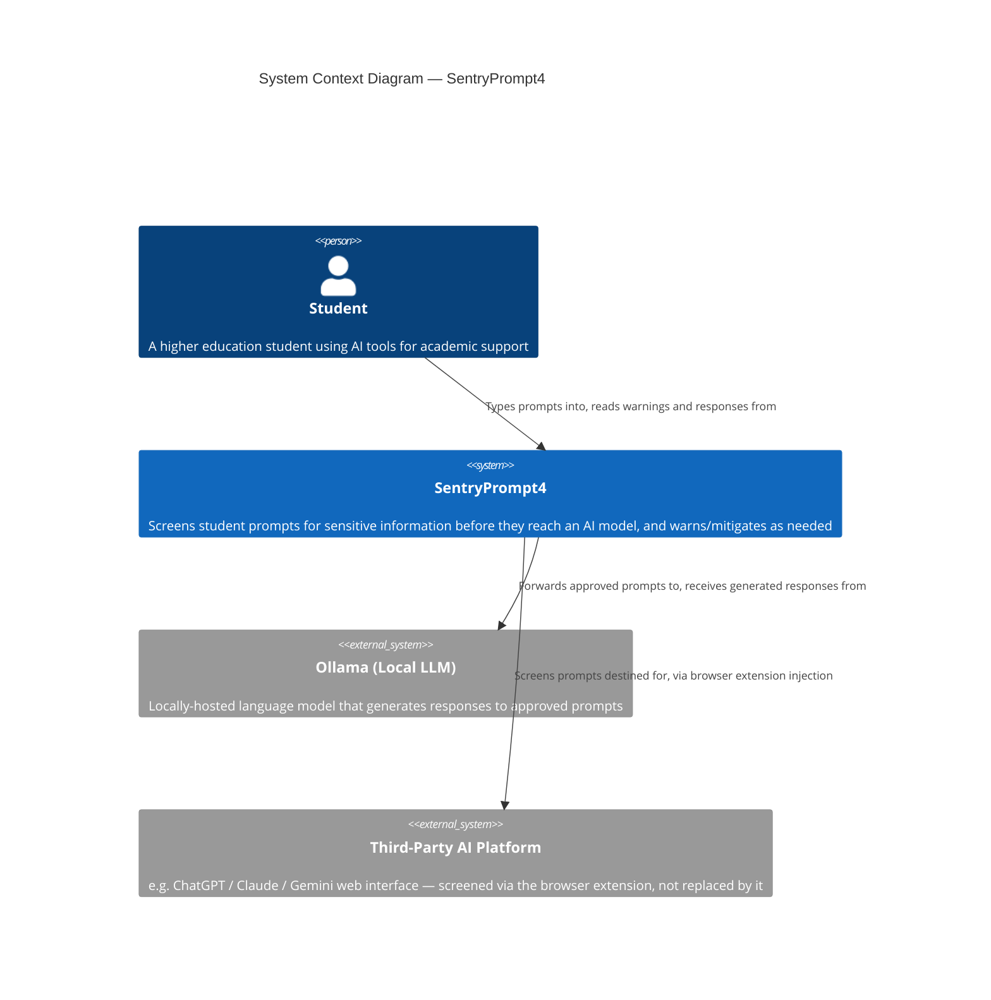
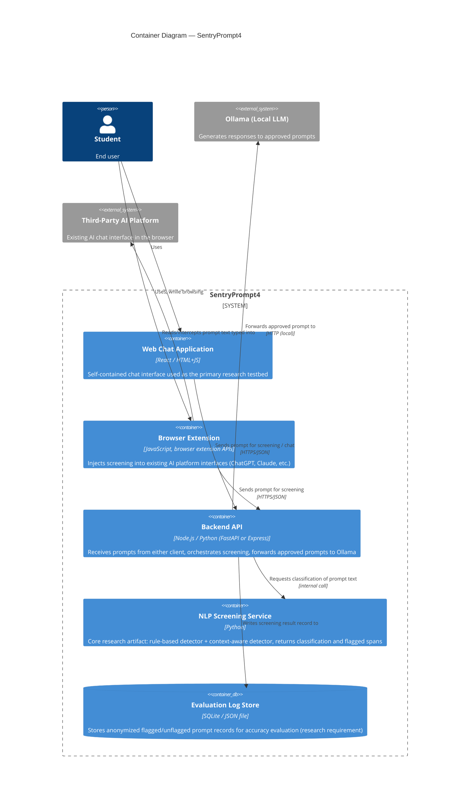
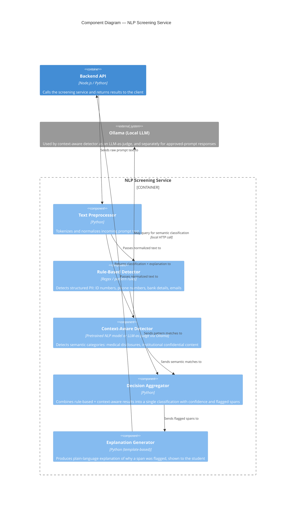

# ARCHITECTURE.md

## Project Title
**SentryPrompt4** — Context-Aware NLP Screening for Sensitive Information in Higher Education AI Prompts

## Domain
Higher Education Technology / Data Privacy & AI Safety — see [SPECIFICATION.md](./SPECIFICATION.md) for full domain description.

## Problem Statement
Students unknowingly expose sensitive personal and institutional data in AI prompts, with no interception mechanism in place before transmission to a third-party model. See [SPECIFICATION.md](./SPECIFICATION.md) for the complete problem statement and POPIA context.

## Individual Scope & Feasibility
Single-user research prototype; one shared backend Screening Service consumed by two thin client surfaces (web app, browser extension); local Ollama backend removes external infrastructure dependency. See [SPECIFICATION.md](./SPECIFICATION.md) §1.3 for full justification.

---

## C4 Model

This project follows the [C4 model](https://c4model.com/): Context → Containers → Components, going from the broadest system view down to internal design.

### Level 1: System Context Diagram

Shows SentryPrompt4 as a single system in relation to its users and external dependencies.

**Key point for this diagram:** SentryPrompt4 does not replace the AI model or the student's preferred platform — it mediates access to them, consistent with the "browser vs. internet" analogy in the specification.

---

### Level 2: Container Diagram

Shows the major deployable/runnable units inside SentryPrompt4 and how they communicate. Both client surfaces are thin — all screening logic lives once, in the Screening Service.

**Design note:** Because both client surfaces call the same Backend API and Screening Service, adding the browser extension does not duplicate the research logic — it only adds a second thin integration point. This keeps the system honest to the "individual scope" feasibility constraint.

---

### Level 3: Component Diagram — NLP Screening Service

Zooms into the Screening Service, which is the actual research contribution of the project.

**Research note:** The Rule-Based Detector and Context-Aware Detector run independently and both feed the Decision Aggregator. This is intentional — running both on every prompt (rather than only falling back to context-aware when rules miss) is what enables the precision/recall comparison described in SPECIFICATION.md §6.

---

## End-to-End Component Summary

| Layer | Component | Responsibility |
|---|---|---|
| Client | Web Chat Application | Primary UI, full round-trip testbed |
| Client | Browser Extension | Screens prompts on third-party AI platforms in place |
| Service | Backend API | Orchestration, routing between clients, screening, and Ollama |
| Service | NLP Screening Service | Core research logic — detection, aggregation, explanation |
| Data | Evaluation Log Store | Supports accuracy/false-positive evaluation |
| External | Ollama | Local LLM — generates responses to approved prompts |
| External | Third-Party AI Platform | Existing tool the extension screens prompts for, without replacing it |

## Links
- [README.md](./README.md)
- [SPECIFICATION.md](./SPECIFICATION.md)
