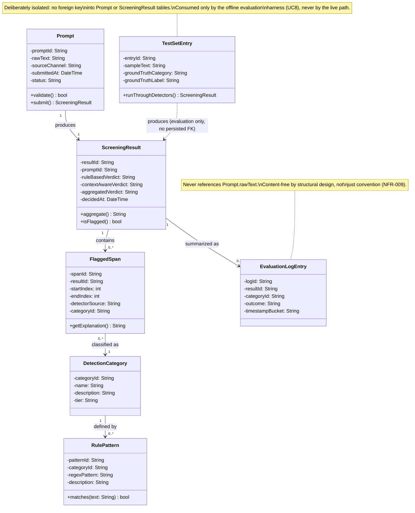
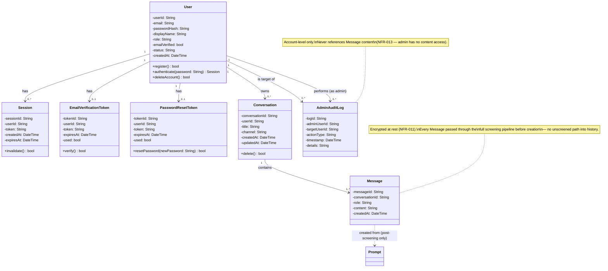

# DOMAIN_MODEL.md — SentryPrompt4

**Traceability:** Entities below are derived directly from REQUIREMENTS.md (FR-001–FR-012) and the architecture consistency findings in Increment 2A. Two design constraints from board review are non-negotiable in this model and are called out wherever they apply:
1. **No entity persists raw prompt text.** (NFR-009)
2. **The evaluation path (FR-012) is structurally independent from the live screening path.** (Increment 2A finding)

---

## 1. Domain Entities

| Entity | Attributes | Methods | Relationships |
|---|---|---|---|
| **Prompt** | `promptId`, `rawText` *(in-memory only — never persisted, see NFR-009)*, `sourceChannel` (webapp / extension), `submittedAt`, `status` | `validate()`, `submit()` | Produces one `ScreeningResult` |
| **ScreeningResult** | `resultId`, `promptId`, `ruleBasedVerdict`, `contextAwareVerdict`, `aggregatedVerdict`, `decidedAt` | `aggregate()`, `isFlagged()` | Belongs to one `Prompt`; has 0..* `FlaggedSpan`; produces 0..1 `EvaluationLogEntry` |
| **FlaggedSpan** | `spanId`, `resultId`, `startIndex`, `endIndex`, `detectorSource` (rule / context), `categoryId` | `getExplanation()` | Belongs to one `ScreeningResult`; references one `DetectionCategory` |
| **DetectionCategory** | `categoryId`, `name`, `description`, `tier` (rule-based / context-aware) | — | Has 0..* `RulePattern` (only for rule-based tier) |
| **RulePattern** | `patternId`, `categoryId`, `regexPattern`, `description` | `matches(text)` | Belongs to one `DetectionCategory` (supports NFR-005, UC10) |
| **EvaluationLogEntry** | `logId`, `resultId`, `categoryId` (nullable), `outcome` (flagged / unflagged / override), `timestampBucket` | — | Content-free by design — belongs to one `ScreeningResult`, but **does not** reference `Prompt.rawText` at all (NFR-009 enforced structurally, not just by convention) |
| **TestSetEntry** *(evaluation path — deliberately unconnected to the four entities above)* | `entryId`, `sampleText`, `groundTruthCategory`, `groundTruthLabel` | `runThroughDetectors()` | Standalone — consumed directly by the evaluation harness (UC8), never touches `Prompt` or `ScreeningResult` |

**Business rules:**
- A `Prompt` never exists in a persisted table — only `ScreeningResult` and `EvaluationLogEntry` (metadata-only) survive past the request lifecycle.
- `FlaggedSpan.detectorSource` must record which detector produced each span individually — verdicts are never merged before this point (enforces FR-004's parallel-detection requirement at the data level, not just the process level).
- `TestSetEntry` has no foreign key into any live-path entity. This is intentional: it is what makes UC8 (Run Evaluation) genuinely independent of live usage, closing the gap Increment 2A identified in the architecture.

---

## 2. Class Diagram (Mermaid)



---

## 3. Design Decisions (from board review, resolved)

| Concern raised | Resolution in this model |
|---|---|
| Software Architect: does `Prompt` persist raw text? | No — `rawText` is explicitly marked in-memory-only; only derived, content-free records persist. |
| Security Architect: transient vs. persisted boundary | Modeled as two separate entity families (`Prompt` = transient, `EvaluationLogEntry` = persisted metadata), not a flag on one entity. |
| Database Architect: no shared primary-key path | `EvaluationLogEntry` has no foreign key back to any field containing raw content — only `resultId`, `categoryId`, and bucketed metadata. |
| AI/ML Architect: evaluation-path independence | `TestSetEntry` has zero foreign keys into the live entities; connected only by a dependency arrow (`..>`) showing it *uses* the same detection logic, not the same data. |
| QA/Test Architect: per-detector verdict tracking | `FlaggedSpan.detectorSource` and `ScreeningResult`'s two separate verdict fields preserve which detector found what, supporting TC-004's precision/recall comparison. |
| Backend Architect: one repository per entity | Each of the 7 entities maps to exactly one planned repository interface in Increment 6 — none require splitting. |
| Product Manager: scope | 7 entities — at the upper bound of the 5–7 target for an individual project, justified by the transient/persisted split rather than padding. |

---

## 5. Scope Expansion: Full Platform (Account, Session, History, Admin)

**Board decision context:** the project scope was expanded from a single-user research prototype to a full account-based platform (registration, login, persistent conversation history, admin panel), per explicit instruction. This is additive to the original 7 research-domain entities, not a replacement — Assignment 4's brief permits Agile-driven scope updates as long as the project doesn't diverge from its Assignment 3 core, and this expansion keeps the screening research at the center.

**Resolved tension (must be understood before reading the entities below):** the original model enforced "no entity persists raw prompt text" (NFR-009) via the `EvaluationLogEntry` design. Persistent conversation history necessarily breaks that rule for a *different* entity (`Message`) — this is intentional and scoped: two data stores, two policies.
- `EvaluationLogEntry` (research artifact) → stays content-free, per NFR-009.
- `Message` (product feature) → legitimately stores content, but is now governed by NFR-011 (encryption at rest) and FR-020 (permanent deletion capability).

### New Entities

| Entity | Attributes | Methods | Relationships |
|---|---|---|---|
| **User** | `userId`, `email`, `passwordHash`, `displayName`, `role` (student / admin), `emailVerified`, `status` (active / suspended), `createdAt` | `register()`, `authenticate()`, `deleteAccount()` | Has 0..* `Session`; has 0..* `Conversation`; has 0..1 `EmailVerificationToken`; has 0..1 `PasswordResetToken` |
| **Session** | `sessionId`, `userId`, `token`, `createdAt`, `expiresAt` | `invalidate()` | Belongs to one `User` |
| **EmailVerificationToken** | `tokenId`, `userId`, `token`, `expiresAt`, `used` | `verify()` | Belongs to one `User` (FR-014) |
| **PasswordResetToken** | `tokenId`, `userId`, `token`, `expiresAt`, `used` | `resetPassword()` | Belongs to one `User` (FR-017) |
| **Conversation** | `conversationId`, `userId`, `title`, `channel` (webapp / extension), `createdAt`, `updatedAt` | `delete()` | Belongs to one `User`; has 1..* `Message` |
| **Message** | `messageId`, `conversationId`, `role` (user / assistant), `content` *(encrypted at rest — NFR-011)*, `createdAt` | — | Belongs to one `Conversation`; a user-role `Message` is created from an approved `Prompt` once screening clears it |
| **AdminAuditLog** | `logId`, `adminUserId`, `targetUserId`, `actionType`, `timestamp`, `details` | — | References `User` (admin) and `User` (target) — account-level only, never references `Message` content (FR-021, NFR-013) |

### How the Product Layer Connects to the Research Layer

```
Prompt (transient, screened)
   │
   ├── if flagged & cancelled → discarded, never persisted, logged content-free in EvaluationLogEntry
   ├── if flagged & sent anyway → persisted as Message (encrypted), logged content-free in EvaluationLogEntry
   └── if clean → persisted as Message (encrypted), logged content-free in EvaluationLogEntry
```

This is the key design decision that keeps the expansion coherent rather than bolted-on: **every** message that ends up in a `Conversation` passed through the exact same screening pipeline already documented in ARCHITECTURE.md — there is no second, unscreened path into persisted chat history.

### Updated Class Diagram Addendum



**Total entity count: 14** (7 research-domain + 7 platform-domain), up from the originally scoped 7.

## Links (updated)
- [ARCHITECTURE.md](./ARCHITECTURE.md)
- [REQUIREMENTS.md](./REQUIREMENTS.md)
- [USE_CASES.md](./USE_CASES.md)