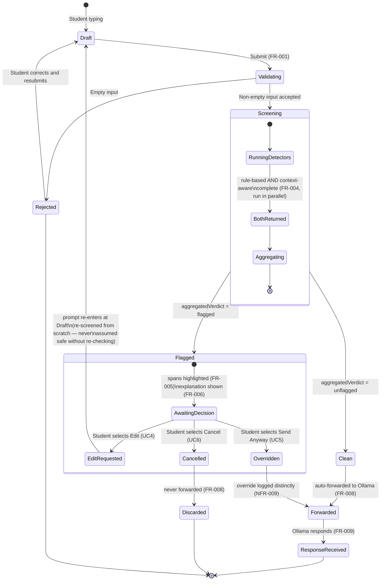
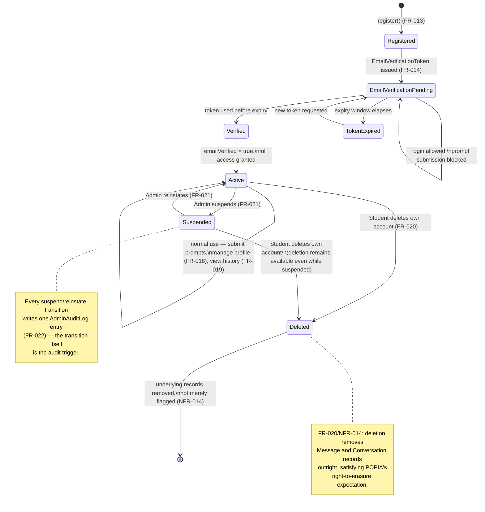
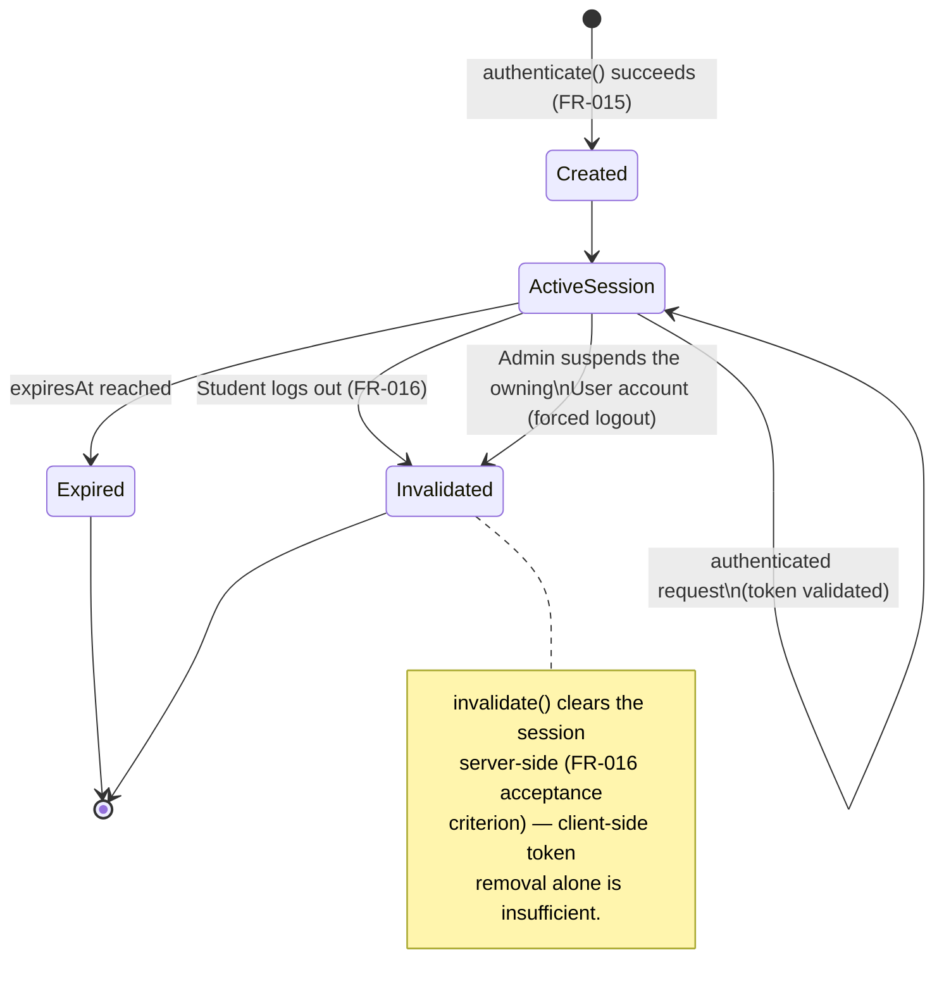
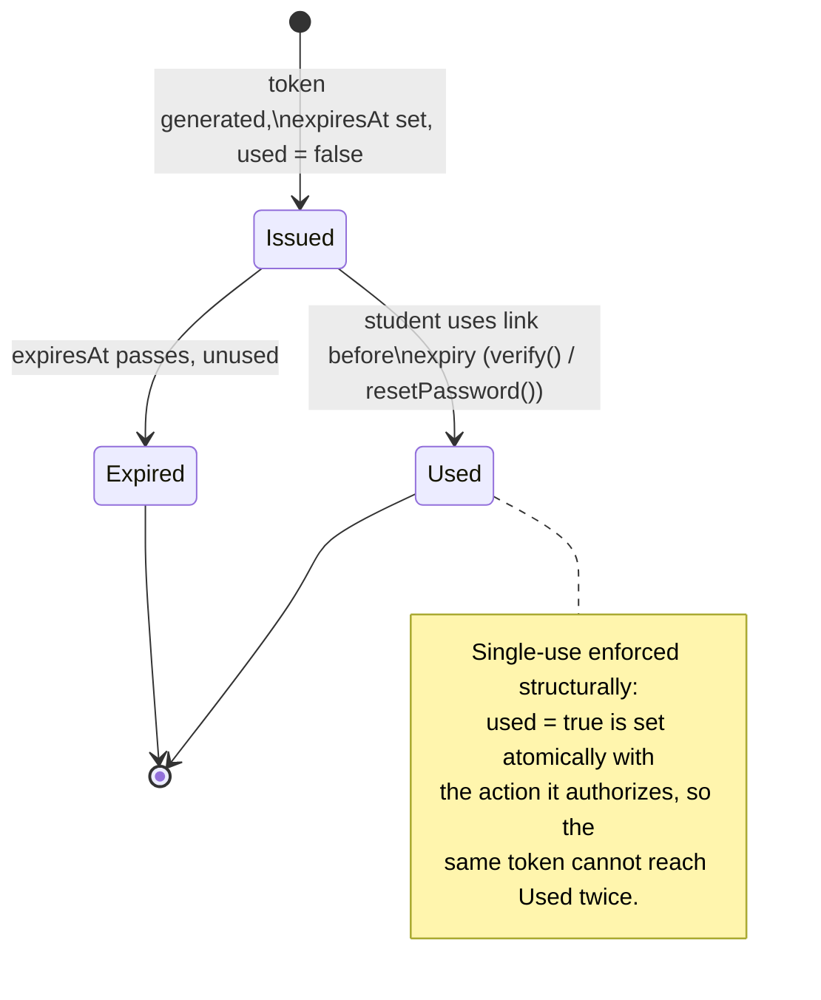

# STATE_DIAGRAMS.md — SentryPrompt4

**Project:** SentryPrompt4
**Traceability:** State machines below model every lifecycle-bearing entity identified in DOMAIN_MODEL.md. Two state machines cover the original research-domain flow (`Prompt` → `ScreeningResult`), and three cover the platform-layer scope expansion (`User`, `Session`, verification/reset tokens), per PROJECT_BACKLOG.md Increment 4's brief: *"now including account lifecycle (registration → verified → active → suspended)."*

**Board note on scope:** four state machines are specified rather than one combined diagram, because `Prompt`, `User`, `Session`, and the token entities each have genuinely independent lifecycles that run on different triggers (a prompt's state resolves in seconds; a user's account state persists indefinitely). Merging them into a single diagram would obscure more than it clarifies — a documented judgment call, not an oversight.

---

## 1. Prompt / Screening Result Lifecycle

**Traces to:** FR-001–FR-008, UC1–UC6
**Entities modeled:** `Prompt.status`, `ScreeningResult.aggregatedVerdict`

**Design notes:**
- The `Screening` composite state has no branch point of its own — both detectors always run to completion before aggregation, enforcing FR-004 (parallel, not fallback) at the state-machine level, not just in prose.
- `EditRequested` loops back to `Draft`, not directly to `Screening` — this makes explicit that an edited prompt is a *new* submission for state-machine purposes, matching UC4's postcondition ("re-screened from scratch").
- `Overridden` and `Clean` both terminate at `Forwarded`, but they are logged as distinguishable events (NFR-009) — the state diagram intentionally keeps them as separate incoming transitions into the same state, rather than merging the arrows, to preserve that distinction visually.

---

## 2. User Account Lifecycle

**Traces to:** FR-013–FR-017, FR-020, FR-021, NFR-014
**Entity modeled:** `User.status`, `User.emailVerified`

**Design notes:**
- `EmailVerificationPending` is deliberately not a dead-end while waiting — login is still permitted (a usability decision recorded in AUTH_DESIGN.md), only prompt submission (the sensitive action) is gated.
- `Deleted` is terminal and unreachable from `EmailVerificationPending`/`Registered` directly in this diagram — an unverified account can still self-delete via the profile/account flow, but that path is out of scope for this diagram since FR-020 is specified against a logged-in student; a supplementary note in AUTH_DESIGN.md's follow-up (tracked in PROJECT_BACKLOG.md) should confirm unverified accounts can also be deleted, since POPIA's erasure right shouldn't depend on verification status.

---

## 3. Session Lifecycle

**Traces to:** FR-015, FR-016, NFR-012
**Entity modeled:** `Session`

**Design notes:**
- The Admin-suspend-forces-logout transition is not separately listed as a functional requirement, but follows directly from NFR-013 (admins have account-level control) combined with FR-021 (suspend blocks access) — a suspended account with a still-valid session would be a real security gap, so this transition is included as a design decision, flagged here for visibility rather than silently assumed in the implementation.

---

## 4. Verification / Password Reset Token Lifecycle

**Traces to:** FR-014, FR-017
**Entities modeled:** `EmailVerificationToken`, `PasswordResetToken` (shared pattern — same state shape, different entity)

**Design notes:**
- One diagram covers both token types because `EmailVerificationToken` and `PasswordResetToken` share an identical attribute shape and lifecycle in DOMAIN_MODEL.md (`tokenId`, `userId`, `token`, `expiresAt`, `used`) — duplicating an identical diagram for each would add length without adding information, so this is documented once with both entities named explicitly.

---

## 5. Board Review Notes

| Concern raised | Resolution |
| --- | --- |
| Why not one merged diagram for all lifecycle entities? | Independent trigger sources (student action, admin action, timer expiry, detector output) make a single diagram unreadable at this entity count; four focused diagrams trace more cleanly to their respective FR-IDs. |
| Does the `Prompt` diagram contradict NFR-009 (no raw text persisted)? | No — the diagram models `status`/`verdict` transitions only; it does not imply `rawText` is stored at any state, consistent with DOMAIN_MODEL.md's explicit in-memory-only note. |
| Is `Suspended → Deleted` a real permitted transition, or an oversight? | Real and intentional — FR-020 gives the student, not the admin, the deletion right, and nothing in REQUIREMENTS.md conditions that right on account status. |
| Gap acknowledged, not solved here | Unverified-account self-deletion path (noted in §2) is deferred to the same AUTH_DESIGN.md follow-up already tracked in PROJECT_BACKLOG.md for FR-018/FR-020/NFR-014. |

## Links

- [ACTIVITY_DIAGRAMS.md](https://github.com/Skiet88/SentryPrompt/blob/main/ACTIVITY_DIAGRAMS.md)
- [DOMAIN_MODEL.md](https://github.com/Skiet88/SentryPrompt/blob/main/DOMAIN_MODEL.md)
- [REQUIREMENTS.md](https://github.com/Skiet88/SentryPrompt/blob/main/REQUIREMENTS.md)
- [USE_CASES.md](https://github.com/Skiet88/SentryPrompt/blob/main/USE_CASES.md)
- [AUTH_DESIGN.md](https://github.com/Skiet88/SentryPrompt/blob/main/AUTH_DESIGN.md)
- [PROJECT_BACKLOG.md](https://github.com/Skiet88/SentryPrompt/blob/main/PROJECT_BACKLOG.md)
