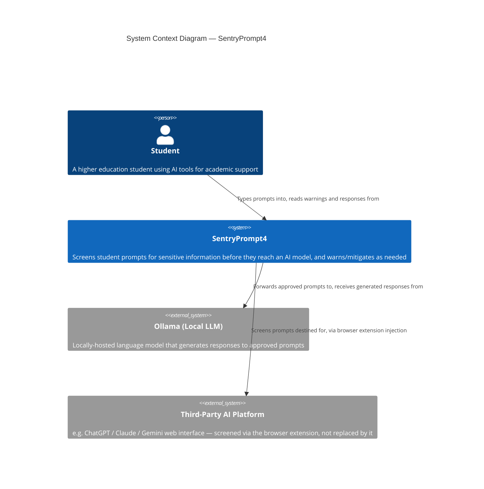
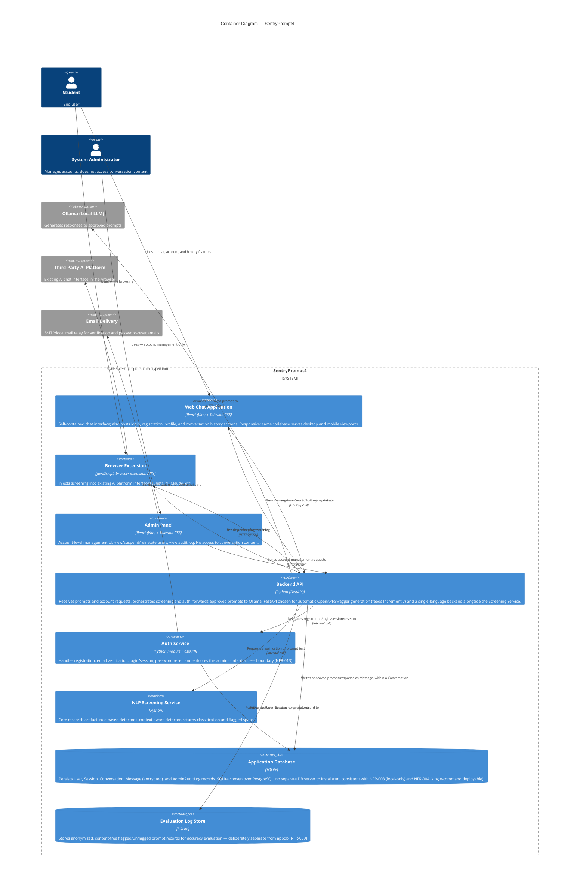
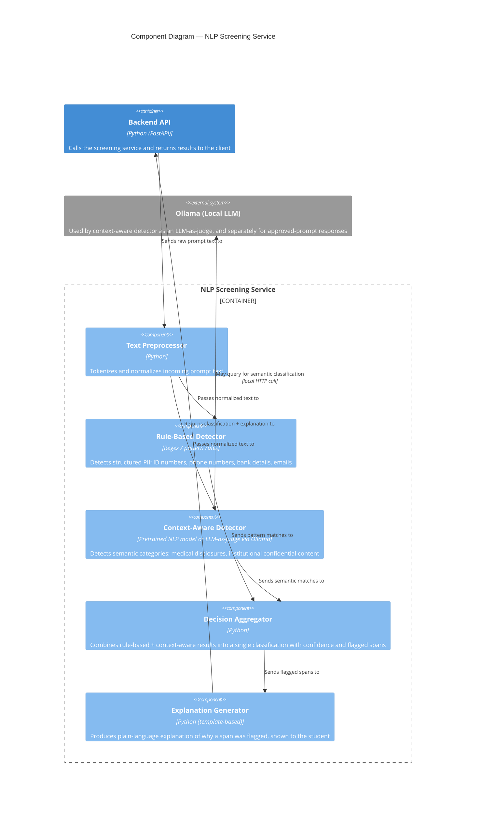

# ARCHITECTURE.md

## Project Title
**SentryPrompt4** — Context-Aware NLP Screening for Sensitive Information in Higher Education AI Prompts

## Domain
Higher Education Technology / Data Privacy & AI Safety — see [../requirements/SPECIFICATION.md](../requirements/../requirements/SPECIFICATION.md) for full domain description.

## Problem Statement
Students unknowingly expose sensitive personal and institutional data in AI prompts, with no interception mechanism in place before transmission to a third-party model. See [../requirements/SPECIFICATION.md](../requirements/../requirements/SPECIFICATION.md) for the complete problem statement and POPIA context.

## Individual Scope & Feasibility
Research prototype expanded to a full account-based platform (registration, login, persistent conversation history, admin panel) alongside the core screening research; one shared backend consumed by two thin client surfaces (web app, browser extension); local Ollama backend removes external infrastructure dependency. See [../requirements/SPECIFICATION.md](../requirements/../requirements/SPECIFICATION.md) §1.3 for full justification and the accepted feasibility trade-off.

---

## C4 Model

This project follows the [C4 model](https://c4model.com/): Context → Containers → Components, going from the broadest system view down to internal design.

### Level 1: System Context Diagram

Shows SentryPrompt4 as a single system in relation to its users and external dependencies.



**Key point for this diagram:** SentryPrompt4 does not replace the AI model or the student's preferred platform — it mediates access to them, consistent with the "browser vs. internet" analogy in the specification.

---

### Level 2: Container Diagram

Shows the major deployable/runnable units inside SentryPrompt4 and how they communicate. Both client surfaces are thin — all screening logic lives once, in the Screening Service.



**Design note:** Because both client surfaces still call the same Backend API and Screening Service, the platform expansion adds two new containers (Auth Service, Admin Panel) and a database, but does not duplicate the research logic — the screening pipeline is unchanged and remains the single source of truth for detection, exactly as before.

---

### Level 3: Component Diagram — NLP Screening Service

Zooms into the Screening Service, which is the actual research contribution of the project.



**Research note:** The Rule-Based Detector and Context-Aware Detector run independently and both feed the Decision Aggregator. This is intentional — running both on every prompt (rather than only falling back to context-aware when rules miss) is what enables the precision/recall comparison described in ../requirements/SPECIFICATION.md §6.

**Gap closed from Increment 2A:** the original diagram had only one entry point into the Screening Service (via the live Backend API), but FR-012 requires evaluation to run independent of live usage. An **Evaluation Harness** (a standalone script, not shown as a separate C4 component since it is a research tool rather than a deployable service) calls the Screening Service's `preprocessor` directly using the same interface the Backend API uses, bypassing `api`, `webapp`, and `extension` entirely. This is the mechanism behind UC8 in ../requirements/USE_CASES.md.

---

## End-to-End Component Summary

| Layer | Component | Responsibility |
|---|---|---|
| Client | Web Chat Application | Primary UI — chat, login/registration, profile, conversation history |
| Client | Browser Extension | Screens prompts on third-party AI platforms in place |
| Client | Admin Panel | Account-level management UI; no conversation-content access |
| Service | Backend API | Orchestration, routing between clients, screening, auth, and Ollama |
| Service | Auth Service | Registration, verification, login/session, password reset |
| Service | NLP Screening Service | Core research logic — detection, aggregation, explanation |
| Data | Application Database | Persists User/Session/Conversation/Message (encrypted)/AdminAuditLog |
| Data | Evaluation Log Store | Content-free, supports accuracy/false-positive evaluation — deliberately separate from Application Database |
| External | Ollama | Local LLM — generates responses to approved prompts |
| External | Third-Party AI Platform | Existing tool the extension screens prompts for, without replacing it |
| External | Email Delivery | Sends verification and password-reset emails |

## Tech Stack Decision (resolved — previously left open as either/or)

Earlier drafts of this diagram deliberately left the implementation language/framework open (e.g. "React / HTML+JS", "Node.js / Python", "PostgreSQL / SQLite") until Increments 6/7 forced the decision. It is now resolved:

| Layer | Choice | Why |
|---|---|---|
| Web Chat Application, Admin Panel | React (Vite) + Tailwind CSS | One responsive codebase for both desktop and mobile viewports, per explicit preference — avoids maintaining separate mobile/desktop UIs. Tailwind's mobile-first breakpoints keep this achievable without hand-written media queries per component. |
| Backend API, Auth Service | Python (FastAPI) | Matches the Screening Service's existing Python (NFR-005/006 context), avoiding a second language/runtime for a solo capstone. FastAPI generates OpenAPI/Swagger documentation automatically, directly feeding Increment 7's deliverable. |
| Application Database | SQLite | No separate database server to install or run — consistent with NFR-003 (local-only) and NFR-004 (single-command deployable). PostgreSQL was considered and rejected as unnecessary operational complexity for a single-user local prototype. |
| Evaluation Log Store | SQLite | Same reasoning as above; kept in a separate database file from the Application Database per NFR-009. |
| Browser Extension | JavaScript, browser extension APIs | Not a choice — Chrome/Firefox extensions require JavaScript; this is a platform constraint, not a stack preference. |

**Honest trade-off, stated plainly:** choosing React over plain HTML+JS means the project now has two toolchains — a Python virtual environment for the backend/screening service, and an npm/Node build step (Vite) for the frontend, even though the backend itself has no Node.js dependency. NFR-004's "single-command or scripted setup" requirement now needs to document both steps (e.g. a top-level script that runs `npm install && npm run build` for the frontend and sets up the Python venv/dependencies for the backend), not assume one covers the other.

### Setup Script Design (NFR-004 — closing the previously-named gap)

PROJECT_BACKLOG.md's board note flagged this as having "no design artefact at all yet." A minimal one is specified here — enough to satisfy "documented single-command or scripted setup" at design phase, without pretending a fully-tested installer exists before implementation:

```bash
#!/usr/bin/env bash
# setup.sh — single documented entry point for NFR-004
set -e

echo "== Backend: Python venv + dependencies =="
python3 -m venv .venv
source .venv/bin/activate
pip install -r backend/requirements.txt

echo "== Frontend: npm dependencies + build =="
cd frontend && npm install && npm run build && cd ..

echo "== Ollama model check =="
ollama list | grep -q llama3.2 || ollama pull llama3.2

echo "Setup complete. Run 'scripts/start.sh' to launch backend + frontend."
```

**Design rationale:** a single shell script, not a Makefile or Docker Compose file — consistent with REPOSITORY_DESIGN.md §1's "Board note" reasoning elsewhere in this project (don't introduce more machinery than a solo prototype needs). Docker was considered and rejected for the same reason PostgreSQL was rejected above: real operational value for a multi-developer/multi-environment deployment, unnecessary complexity for a single-user local research prototype. The script is idempotent-ish by construction (`ollama pull` is a no-op if the model is already present) but is explicitly **not yet tested end-to-end** — that verification is implementation-phase work, stated honestly rather than assumed to work on the first real run.

---

## Links
- [README.md](./README.md)
- [../requirements/SPECIFICATION.md](../requirements/../requirements/SPECIFICATION.md)
- [../requirements/REQUIREMENTS.md](../requirements/../requirements/REQUIREMENTS.md)
- [DOMAIN_MODEL.md](DOMAIN_MODEL.md)
- [AUTH_DESIGN.md](AUTH_DESIGN.md)
- [ERD.md](ERD.md)

---