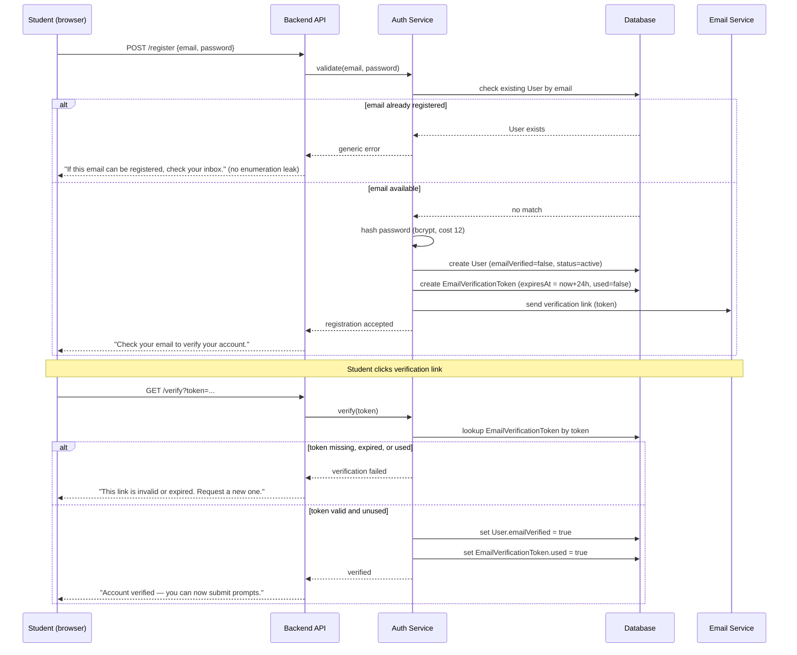
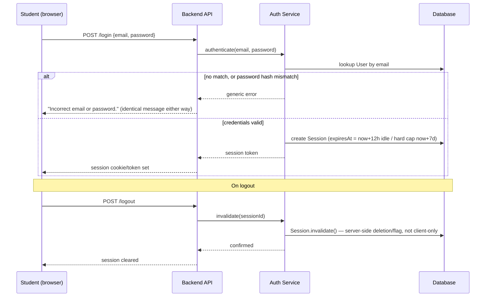
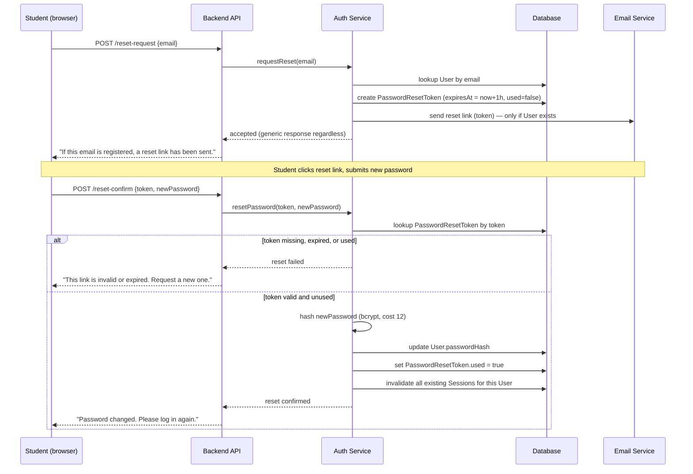

# AUTH_DESIGN.md — SentryPrompt4

**Increment:** 4B — Auth & Account Module Design
**Traces to:** FR-013–FR-018, FR-021, FR-022, NFR-011, NFR-012, NFR-013, NFR-014 (../requirements/REQUIREMENTS.md); `User`, `Session`, `EmailVerificationToken`, `PasswordResetToken` (DOMAIN_MODEL.md §5)

This document specifies the concrete flows behind the Auth Service container already present in ARCHITECTURE.md and the entities already defined in DOMAIN_MODEL.md. It does not introduce new scope — every decision below resolves an ambiguity that was already implied but not yet pinned down (e.g. DOMAIN_MODEL.md defines `EmailVerificationToken.expiresAt` as an attribute, but no document yet states what that expiry window actually is).

---


## 1. Concrete Parameters (previously undefined attributes, now fixed)

| Parameter | Value | Rationale |
|---|---|---|
| Email verification token lifetime | 24 hours | Long enough for a student to check email once, short enough to limit exposure if the email is somehow intercepted. |
| Password reset token lifetime | 1 hour | Shorter than verification — reset tokens grant password-change power, a higher-value target if leaked. |
| Session lifetime | 12 hours idle timeout, 7 days absolute maximum | Idle timeout limits exposure on a shared/lost device; absolute cap forces periodic re-authentication regardless of activity. |
| Password hashing algorithm | bcrypt, cost factor 12 | Satisfies NFR-012; bcrypt chosen over Argon2 for this prototype for library maturity and simpler local setup — acceptable trade-off for a solo capstone, documented rather than silently picked. |
| Failed login lockout | No hard lockout; generic error only | A lockout mechanism is itself a denial-of-service vector on a single-user-scale prototype and is out of scope (Product Manager note above) — generic error messaging (below) is the accepted mitigation instead. |

---

## 2. Registration & Verification Flow (FR-013, FR-014)



**Design note:** the response to registration is worded identically whether or not the email was already registered, per the Security Architect's note above — this closes the same enumeration gap FR-015 already requires for login.

---

## 3. Login & Session Flow (FR-015, FR-016)



**Design note (Backend Architect):** every authenticated request re-checks `Session.expiresAt` server-side against both the idle window and the absolute cap — a session is never trusted merely because a client still holds the token.

---

## 4. Password Reset Flow (FR-017)



**Design note (Database Architect):** invalidating all existing sessions on a successful password reset is a deliberate addition — if a reset was triggered because a password was compromised, an attacker's existing session should not survive the reset.

---

## 5. Account-Status Gate on Prompt Submission (FR-014 enforcement point)

Per the AI/ML Architect's note above, the unverified-account restriction is enforced at the same layer as authentication, not only in the UI:

```mermaid
flowchart TD
    A[Prompt submission request arrives at Backend API] --> B{Valid session?}
    B -- No --> C[401 — reject, redirect to login]
    B -- Yes --> D{User.emailVerified == true?}
    D -- No --> E[403 — "Verify your email before submitting prompts"]
    D -- Yes --> F{User.status == active?}
    F -- No, suspended --> G[403 — "Account suspended, contact admin"]
    F -- Yes --> H[Proceed to Screening Service]
```

This gate sits in front of the Screening Service entry point already documented in ARCHITECTURE.md's Component diagram — a direct API call cannot bypass it, since it is checked server-side before the request reaches the screening pipeline at all.

---

## 6. Admin-Panel Access Boundary (FR-021, NFR-013)

This is the module's most important non-negotiable rule, already stated in ../requirements/REQUIREMENTS.md and DOMAIN_MODEL.md — restated here as an enforceable design rule, not just a policy statement:

- Every admin-panel endpoint checks `User.role == 'admin'` server-side (never a client-side-only check).
- Admin endpoints operate exclusively on `User` fields (`status`, `emailVerified`) and `AdminAuditLog` — **no admin endpoint queries or returns `Conversation` or `Message` records, structurally.** This mirrors the DOMAIN_MODEL.md decision that `AdminAuditLog` never references `Message` content.
- Every admin action (suspend, reinstate) writes one `AdminAuditLog` entry before or atomically with the action itself — not as an afterthought log call that could silently fail and leave an unaudited action.

| Admin action | Reads/writes | Explicitly cannot touch |
|---|---|---|
| View user list | `User` (status, emailVerified, createdAt) | `Conversation`, `Message` |
| Suspend user | `User.status`, writes `AdminAuditLog` | `Conversation`, `Message` |
| Reinstate user | `User.status`, writes `AdminAuditLog` | `Conversation`, `Message` |
| View audit log | `AdminAuditLog` | `Conversation`, `Message` |

---

## 8. Profile Management & Account Deletion Cascade (FR-018, FR-020, NFR-014)

**Closing the gap flagged below (§7's original note) rather than leaving it open into the final submission.** These are genuinely simpler flows than §2–§4 — no token issuance, no expiry windows — which is why they were deferred initially, but "simpler" still needs a concrete cascade order specified, since an unspecified delete order on a multi-table account is exactly the kind of design gap that undermines a right-to-erasure claim.

### 8.1 Profile View/Edit (FR-018)

`GET/PUT /api/profile` reads/writes `User.displayName` and `User.email` directly. Per REQUIREMENTS.md's acceptance criterion, an email change re-triggers FR-014: `User.emailVerified` is reset to `false` and a new `EmailVerificationToken` is issued exactly as in §2 — this is not a new mechanism, it's the existing registration-verification flow re-entered.

### 8.2 Account Deletion Cascade (FR-020, NFR-014)

`DELETE /api/profile` triggers deletion, orchestrated by `AuthService`/`ConversationService` at the **service layer**, not left to cascading foreign-key constraints at the database layer — per REPOSITORY_DESIGN.md §3.1's comment that a repository only deletes its own table; the service is what sequences the cascade. Concrete order, specified here for the first time:

1. Invalidate and delete all `Session` rows for the user (no lingering authenticated requests mid-deletion).
2. Delete all `Message` rows across all of the user's `Conversation`s.
3. Delete all `Conversation` rows for the user.
4. Delete any unused `EmailVerificationToken`/`PasswordResetToken` rows for the user.
5. Delete the `User` row itself, last — every row that references `userId` as a foreign key is gone before the row they reference is removed, avoiding an orphaned-FK state even transiently.
6. `AdminAuditLog` rows where this user was previously a `targetUserId` are **not deleted** — the audit trail's immutability (FR-022) takes precedence over erasure for administrative action history; only the user's own content and account row are erased, not the record that an admin once suspended/reinstated them. This is a deliberate precedence decision between two requirements that could otherwise conflict, stated explicitly rather than left for an implementer to guess.

**Single-action requirement (FR-020's acceptance criterion):** steps 1–5 execute as one service-layer transaction/call from the student's perspective — a single `DELETE /api/profile` request, not a multi-step wizard — satisfying "a single action" without requiring five separate API calls from the client.

**Unverified-account deletion (closing STATE_DIAGRAMS.md §2's noted gap):** this same cascade applies regardless of `User.emailVerified` state — POPIA's erasure right is not conditioned on verification status, so an unverified account can self-delete via the same endpoint and cascade above.

---

## 9. Summary Table — Requirement Coverage

| Requirement | Covered by |
|---|---|
| FR-013 (registration) | §2 |
| FR-014 (email verification) | §2, §5 |
| FR-015 (login) | §3 |
| FR-016 (logout) | §3 |
| FR-017 (password reset) | §4 |
| FR-018 (profile view/edit) | §8.1 |
| FR-020 (conversation/account deletion) | §8.2 |
| FR-021 (admin panel boundary) | §6 |
| FR-022 (audit log) | §6, §8.2 (precedence over erasure) |
| NFR-011 (encryption at rest) | Out of scope for this document — applies to `Message`, covered under Increment 5 (ERD/Data Pipeline) |
| NFR-012 (password hashing) | §1, §2, §4 |
| NFR-013 (admin no content access) | §6 |
| NFR-014 (right to erasure) | §8.2 |

**Gap closed:** FR-018 and FR-020 are now specified in §8, including the concrete account-deletion cascade order and its precedence decision against FR-022's audit-log immutability. This was previously deferred as a follow-up; it is resolved here rather than carried forward unresolved into the final submission.

## Links
- [../requirements/REQUIREMENTS.md](../requirements/../requirements/REQUIREMENTS.md)
- [DOMAIN_MODEL.md](DOMAIN_MODEL.md)
- [ARCHITECTURE.md](ARCHITECTURE.md)
- [../requirements/PROJECT_BACKLOG.md](../requirements/../requirements/PROJECT_BACKLOG.md)