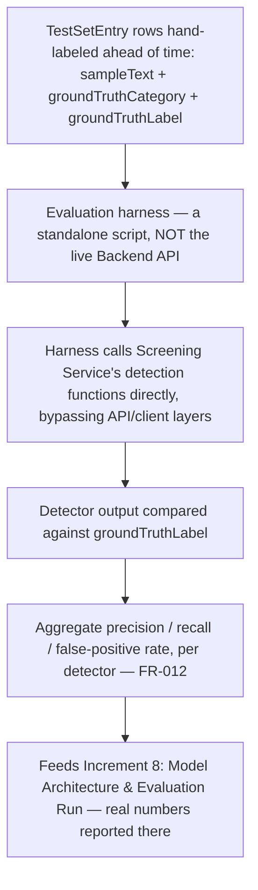

# DATA_PIPELINE.md — SentryPrompt4

**Increment:** 5 — Data Model: ERD & AI Data Pipeline (second artifact)
**Traces to:** FR-004, FR-011, FR-012 (../requirements/REQUIREMENTS.md); ERD.md (schema this pipeline reads/writes); DOMAIN_MODEL.md §1 (`TestSetEntry` independence); Increment 2A gap (no documented offline evaluation entry point)

This document specifies **how data moves** through SentryPrompt4's two structurally separate paths — the live path (real student prompts) and the evaluation path (offline, hand-labeled test set). ERD.md specifies the schema these paths read and write; this document specifies the flow itself, kept as a distinct artifact per this increment's own scope in ../requirements/PROJECT_BACKLOG.md.

---

## 1. Why Two Separate Paths (recap, not a new decision)

This separation was already established in DOMAIN_MODEL.md (`TestSetEntry` has zero foreign keys into live tables) and flagged as an architecture gap in Increment 2A (ARCHITECTURE.md had no documented entry point for offline evaluation). This document is where that gap gets closed concretely, as Increment 2A's own note said it would be.

**The risk of not separating them:** if the evaluation harness reused the live Backend API, every test-set run would produce real `EvaluationLogEntry` rows indistinguishable from genuine student activity — corrupting the exact metrics FR-011's logging exists to produce, and making FR-012's "independent of live usage" requirement false in practice even if true on paper.

---

## 2. Live Path — Every Real Prompt, Screened or Not

```mermaid
flowchart TD
    A[Student submits Prompt via webapp/extension] --> B[Screening Service: rule-based + context-aware detectors run in parallel — FR-004]
    B --> C[ScreeningResult created in-memory, FlaggedSpan(s) attached if flagged]
    C --> D[EvaluationLogEntry written — content-free, categoryId nullable if unflagged — NFR-009]
    D --> E{Student decision on flagged prompt}
    E -- cancel --> F[Prompt discarded — nothing further persisted]
    E -- send anyway --> G[Message created in student's Conversation, encrypted at rest — NFR-011]
    C -- not flagged --> G
    G --> H[Prompt object discarded after request completes — it was never a table row]
```

**Data touched:** `ScreeningResult` (in-memory only, never a table — see ERD.md), `FlaggedSpan` (schema-backed), `EvaluationLogEntry` (schema-backed, content-free), `Message` (schema-backed, encrypted).

---

## 3. Evaluation Path — Offline, Independent of Live Usage



**Data touched:** `TestSetEntry` only, read-only. No row in any live-path table (`ScreeningResult`'s in-memory object, `EvaluationLogEntry`, `Message`) is created, read, or modified by this path.

**Concrete rule enforced here:** the evaluation harness is a separate executable/script that imports the Screening Service's detection functions directly. It does not call the Backend API's `/screen` endpoint (or equivalent), and it does not write to `EvaluationLogEntry` — that table is populated only by real, live student submissions.

---

## 4. Path Independence — Verification Table

| Question | Live path | Evaluation path |
|---|---|---|
| Entry point | Backend API (student-facing) | Standalone harness script |
| Reads `TestSetEntry`? | Never | Always |
| Writes `EvaluationLogEntry`? | Always (every real prompt) | Never |
| Writes `Message`? | When approved/sent | Never |
| Can one path's failure affect the other? | No — no shared write path, no shared table | No — see above |

This table exists so the independence claim (DOMAIN_MODEL.md, Increment 2A) has something concrete a marker or a future test case can check against, per the QA/Test Architect's note during the ERD board review.

---

## 5. What This Document Does Not Cover

- The actual precision/recall/false-positive **numbers** — that's Increment 8's deliverable; this document specifies the pipeline the numbers will come from, not the numbers themselves.
- Model architecture details for the context-aware (Ollama-backed) detector — also Increment 8.
- Deletion/cascade behavior for `Message`/`Conversation` rows — now specified in AUTH_DESIGN.md §8.2, not this document (kept there since it's an Auth/account-lifecycle concern, not a data-pipeline-flow concern).

## Links
- [ERD.md](ERD.md)
- [DOMAIN_MODEL.md](DOMAIN_MODEL.md)
- [../requirements/REQUIREMENTS.md](../requirements/../requirements/REQUIREMENTS.md)
- [../requirements/PROJECT_BACKLOG.md](../requirements/../requirements/PROJECT_BACKLOG.md)