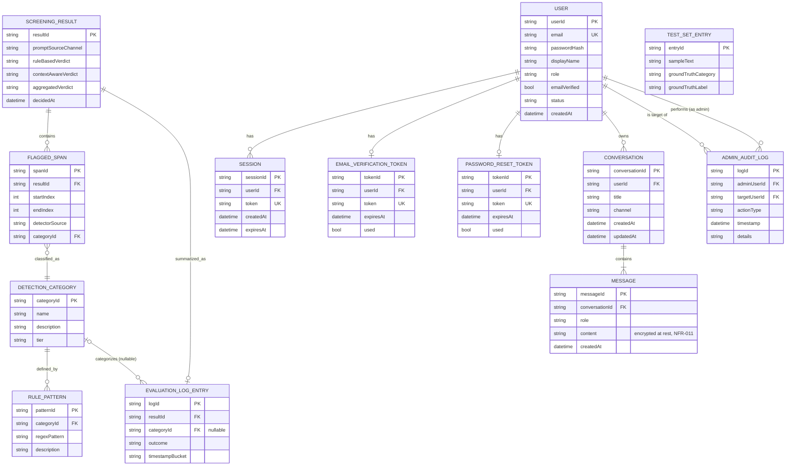

# ERD.md — SentryPrompt4

**Increment:** 5 — Data Model: ERD & AI Data Pipeline
**Traces to:** DOMAIN_MODEL.md (all 14 entities), ../requirements/REQUIREMENTS.md NFR-009, NFR-011, NFR-012, NFR-014
**Note on scope:** this document adds concrete database-level detail (types, keys, constraints) to entities already defined conceptually in DOMAIN_MODEL.md. No new entity or relationship is introduced here that DOMAIN_MODEL.md didn't already specify.

---

## 1. Entity-Relationship Diagram

Per the Database Architect's note above, **`Prompt` is deliberately excluded from this ERD** — it is a transient, in-memory-only object (DOMAIN_MODEL.md §1) and has no corresponding table. Its shape is documented in DOMAIN_MODEL.md and referenced here only as a conceptual source for `Message` and `EvaluationLogEntry`.

**Note:** `TEST_SET_ENTRY` is drawn with no relationship lines to any other entity — this is intentional and mirrors DOMAIN_MODEL.md exactly. It is consumed only by the offline evaluation harness (§3 below), never joined against live tables.

---

## 2. Schema Notes & Constraints

| Table | Key constraints | Rationale |
|---|---|---|
| `USER` | `email` UNIQUE | Prevents duplicate registration (FR-013); enforced at the database level, not just application logic. |
| `SESSION` | `token` UNIQUE, index on `expiresAt` | Fast lookup on every authenticated request; supports the idle-timeout check in AUTH_DESIGN.md §3. |
| `EMAIL_VERIFICATION_TOKEN` | `token` UNIQUE | Per Backend Architect's note — a duplicate active token is a defect class, not just an edge case. |
| `PASSWORD_RESET_TOKEN` | `token` UNIQUE | Same reasoning as above. |
| `EVALUATION_LOG_ENTRY` | `categoryId` FK is **nullable** | An "unflagged" outcome has no category to reference — this must be a valid, not a worked-around, state (Security Architect's note above). |
| `MESSAGE` | `content` stored encrypted (application-layer encryption before write, AES-256 per NFR-011) | The database itself stores ciphertext; the encryption key is managed by the Auth/Backend service, not the database layer, so a raw database dump alone does not expose conversation content. |
| `TEST_SET_ENTRY` | No foreign keys to any other table | Structural independence guarantee (DOMAIN_MODEL.md, AI/ML Architect's note above). |
| `ADMIN_AUDIT_LOG` | Two FKs to `USER` (`adminUserId`, `targetUserId`); **no FK to `MESSAGE` or `CONVERSATION`** | Enforces NFR-013 at the schema level — there is no column an admin query could join through to reach conversation content, even by mistake. |

---

## 2A. Normalization — Third Normal Form (3NF)

Stated explicitly here since the rubric's B3 criterion (Data/ERD/DFD/Wireframe, 8 marks) requires it named, not just implied by a clean-looking diagram:

- **1NF:** every column holds a single atomic value — no repeating groups or multi-valued fields (e.g. `AdminAuditLog.details` is a single descriptive string per action, not a delimited list of multiple actions).
- **2NF:** every table uses a single-column surrogate primary key (`userId`, `resultId`, `messageId`, etc.), so there is no composite key for a partial-dependency violation to exist against.
- **3NF:** no non-key attribute depends on another non-key attribute. Concretely: `SCREENING_RESULT` stores verdicts and a timestamp, all of which depend only on `resultId`, not on each other; `USER` stores `email`/`passwordHash`/`role`/`status`, each dependent only on `userId`; `CATEGORY`-derived data (`name`, `description`, `tier`) lives once in `DETECTION_CATEGORY` and is referenced by FK from `FLAGGED_SPAN`/`RULE_PATTERN`/`EVALUATION_LOG_ENTRY` rather than duplicated across them — the exact transitive-dependency case 3NF exists to eliminate.

**One deliberate exception, stated rather than hidden:** `SCREENING_RESULT.promptSourceChannel` is a denormalized copy of what would otherwise require joining back through a (non-existent, by design) `Prompt` table — since `Prompt` is explicitly transient/never persisted (DOMAIN_MODEL.md §1), there is no live table to normalize this against. This is a structural consequence of the transient/persisted split already justified elsewhere, not a normalization oversight.

---

## 3. Summary Table — Requirement Coverage

| Requirement | Covered by |
|---|---|
| NFR-009 (no raw content in evaluation logs) | §2 (`EVALUATION_LOG_ENTRY` schema note) |
| NFR-011 (encryption at rest) | §2 (`MESSAGE` schema note) |
| NFR-012 (password hashing) | Enforced at write-time by Auth Service (AUTH_DESIGN.md §1–§2); ERD stores only the resulting hash, never plaintext |
| NFR-014 (right to erasure) | Cascade order now specified in [AUTH_DESIGN.md](AUTH_DESIGN.md) §8.2 (Sessions → Messages → Conversations → tokens → User, in that order) |
| FR-011, FR-012 (evaluation logging & independent test harness) | See [DATA_PIPELINE.md](DATA_PIPELINE.md) — the data flow itself is documented there, this ERD only covers the schema it reads/writes |

**Gap closed:** the exact cascade behavior on account/conversation deletion (which rows in `CONVERSATION`, `MESSAGE`, `SESSION`, etc. get removed and in what order) is now specified in AUTH_DESIGN.md §8.2, rather than left as a deferred follow-up.

## Links
- [DOMAIN_MODEL.md](DOMAIN_MODEL.md)
- [AUTH_DESIGN.md](AUTH_DESIGN.md)
- [DATA_PIPELINE.md](DATA_PIPELINE.md)
- [../requirements/REQUIREMENTS.md](../requirements/../requirements/REQUIREMENTS.md)
- [../requirements/PROJECT_BACKLOG.md](../requirements/../requirements/PROJECT_BACKLOG.md)