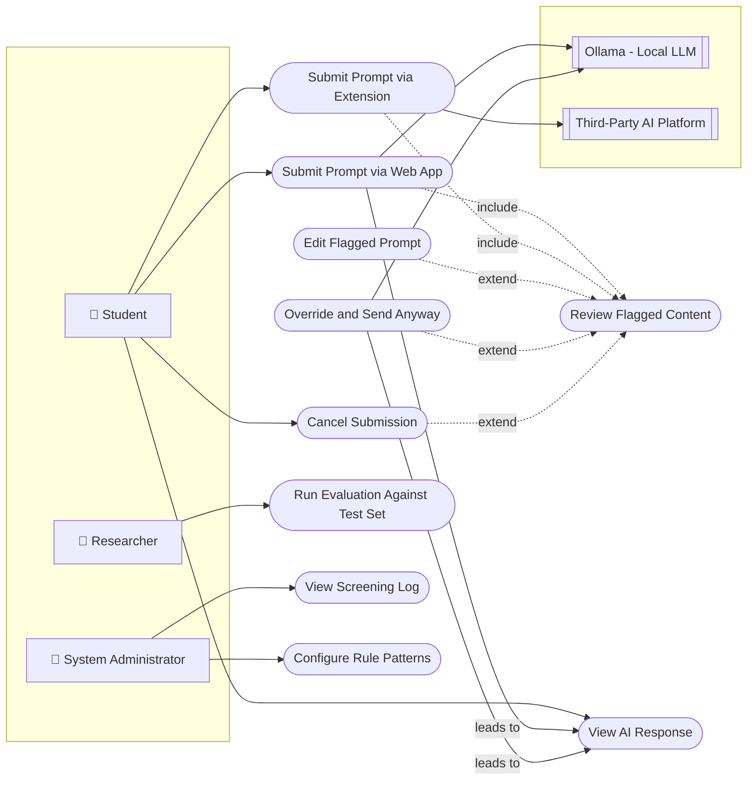

# USE_CASES.md — SentryPrompt4

**Traceability:** Actors are drawn from STAKEHOLDER_ANALYSIS.md; use cases are drawn from the 12 functional requirements in REQUIREMENTS.md. Every use case references the FR-ID(s) it operationalizes.

**Revision note:** this is a revised version. The initial draft contained a UML modeling error (an internal system listed as an actor), incorrect `extend` relationship direction, and two use cases referenced in the diagram but never specified. All three are corrected below, with the correction itself documented rather than silently fixed, per the board's standard of showing the review trail.

---

## 1. Actors

| Actor | Type | Based on Stakeholder |
|---|---|---|
| **Student** | Primary human actor | Student |
| **Researcher** *(the student, in an evaluation role — distinct interaction pattern from day-to-day use)* | Human actor | Project Supervisor / Assessor (evaluation need) |
| **System Administrator** *(the student, in a deployment/config role)* | Human actor | IT Security / Systems Administrator |
| **Ollama (Local LLM)** | External system actor | Ollama Maintainers |
| **Third-Party AI Platform** | External system actor | (implied by extension use case) |

**Why only 5 actors, not 6+:** the supervisor's prior brief (written for team projects) targets 6+ actors. A sixth actor was deliberately **not** invented to hit that number. An earlier draft of this document listed "Backend API" as a sixth actor — that was a modeling error: in UML, an actor must be external to the system boundary, and the Backend API is part of the system under design, not an external party interacting with it. Removing it is more defensible than padding the count with something that doesn't belong. Three of the five actors above being the same physical person in different functional roles is intentional (each role has a genuinely different goal and interaction pattern with the system), not a workaround.

---

## 2. Use Case Diagram

**Legend:** solid arrows = actor-initiates-use-case or use-case-leads-to-use-case; dashed arrows labeled `include` = the base use case always triggers the included one; dashed arrows labeled `extend` = the extending use case optionally branches from the base, arrow drawn from the extending use case to the base it extends (per UML convention — corrected from the prior draft, which had this backwards).

*(Rendered as a flowchart rather than classic UML ellipse/stick-figure notation — Mermaid has no native UML use-case diagram type; this is a documented workaround, consistent with the assignment brief's own allowance for Mermaid.)*

---

## 3. Use Case Specifications (8 selected as critical, per assignment guidance)

### UC1 — Submit Prompt via Web App
- **Traces to:** FR-001, FR-002, FR-003, FR-004
- **Actor:** Student
- **Precondition:** Student has the web app open; Backend API and Screening Service are running.
- **Postcondition:** Prompt has been classified by both detectors; student sees either a clean pass-through or a flagged result.
- **Basic Flow:**
  1. Student types a prompt into the web app.
  2. Student submits the prompt.
  3. System validates the input is non-empty (FR-001).
  4. System runs rule-based and context-aware detection in parallel (FR-002, FR-003, FR-004).
  5. System aggregates results.
  6. If no flag: proceed to UC7. If flagged: proceed to UC3.
- **Alternative Flow:** Empty input submitted → system rejects with a validation message (FR-001); no detection run.

### UC2 — Submit Prompt via Extension
- **Traces to:** FR-010
- **Actor:** Student
- **Precondition:** Extension is installed and active on a supported third-party AI platform page.
- **Postcondition:** Prompt intercepted before reaching the third-party platform's own submission.
- **Basic Flow:**
  1. Student types a prompt into the third-party platform's native input field.
  2. Extension intercepts the text before the platform's own send action fires.
  3. Extension sends the text to the Backend API for screening (joins UC1's flow from step 3).
  4. Proceed to UC3 if flagged; otherwise the extension allows the platform's native submission to proceed.
- **Alternative Flow (known limitation, not resolved by design):** third-party platform changes its DOM structure and the extension fails to intercept → system fails open (prompt goes through unscreened). Carried forward as a named risk in the Evaluation of Design (Increment 13), not hidden.

### UC3 — Review Flagged Content
- **Traces to:** FR-005, FR-006
- **Actor:** Student
- **Precondition:** Aggregator has returned a flagged classification with spans and explanation.
- **Postcondition:** Student has seen exactly what was flagged and why, in plain language.
- **Basic Flow:**
  1. System highlights the flagged span(s) in the original prompt text (FR-005).
  2. System displays a plain-language explanation per flagged category, naming the risk (FR-006).
  3. Student reads the explanation.
  4. Student proceeds to UC4, UC5, or UC6.

### UC4 — Edit Flagged Prompt
- **Traces to:** FR-007
- **Actor:** Student
- **Precondition:** UC3 has occurred.
- **Postcondition:** Modified prompt is re-submitted for screening (loops back to the detection step of UC1/UC2).
- **Basic Flow:** Student edits the flagged text directly → resubmits → system re-screens from scratch (the edit is never assumed safe without re-checking).

### UC5 — Override and Send Anyway
- **Traces to:** FR-007, FR-008
- **Actor:** Student
- **Precondition:** UC3 has occurred.
- **Postcondition:** Original (flagged) prompt is forwarded to Ollama despite the flag; the override is logged distinctly from an unflagged pass-through.
- **Basic Flow:** Student selects "Send Anyway" → system logs an explicit override event (NFR-009 still applies — content itself is not logged, only that an override occurred) → prompt forwarded to Ollama → proceed to UC7.

### UC6 — Cancel Submission
- **Traces to:** FR-007
- **Actor:** Student
- **Precondition:** UC3 has occurred.
- **Postcondition:** Prompt is discarded; nothing forwarded to Ollama or the third-party platform.

### UC8 — Run Evaluation Against Test Set
- **Traces to:** FR-012
- **Actor:** Researcher
- **Precondition:** A hand-labeled test set exists (PROJECT_BACKLOG.md, Increment 8); Screening Service is running.
- **Postcondition:** Precision, recall, and false-positive rate are computed and recorded, independent of any live student-facing session.
- **Basic Flow:**
  1. Researcher runs the evaluation script against the labeled test set.
  2. Script calls the Screening Service directly, bypassing the web app/extension UI layer.
  3. Script compares detector output to ground-truth labels per entry.
  4. Script outputs aggregate precision/recall/false-positive metrics.
- **Board note:** this use case exposed the architecture gap found in Increment 2A (no documented offline entry point into the Screening Service). This specification assumes that gap is closed before Increment 8 is implemented — tracked, not yet built.

### UC9 — View Screening Log
- **Traces to:** FR-011
- **Actor:** System Administrator
- **Precondition:** Evaluation Log Store contains records.
- **Postcondition:** Administrator can review aggregate flagged/unflagged activity without seeing raw sensitive content (NFR-009).

---

## 4. Use Cases Referenced But Not Individually Specified

Per the assignment guidance ("select 8 critical use cases"), the following two appear in the diagram for completeness but were not selected for detailed specification, with reasons stated rather than left unexplained:

| Use Case | One-line description | Why not detailed |
|---|---|---|
| **UC7 — View AI Response** | Student views Ollama's generated response, displayed in whichever interface (web app or third-party platform) the prompt originated from. Traces to FR-009. | Low complexity — a straightforward display step with no branching logic or decision points worth a full spec. |
| **UC10 — Configure Rule Patterns** | Administrator edits the rule-based detector's pattern configuration file to add/adjust a detection category. | Administrative/maintenance use case (supports NFR-005), not part of the core research-facing flow the other 8 use cases describe. |

## Links
- [SPECIFICATION.md](SPECIFICATION.md)
- [REQUIREMENTS.md](REQUIREMENTS.md)
- [STAKEHOLDER_ANALYSIS.md](STAKEHOLDER_ANALYSIS.md)
- [../architecture/ARCHITECTURE.md](../architecture/../architecture/ARCHITECTURE.md)
